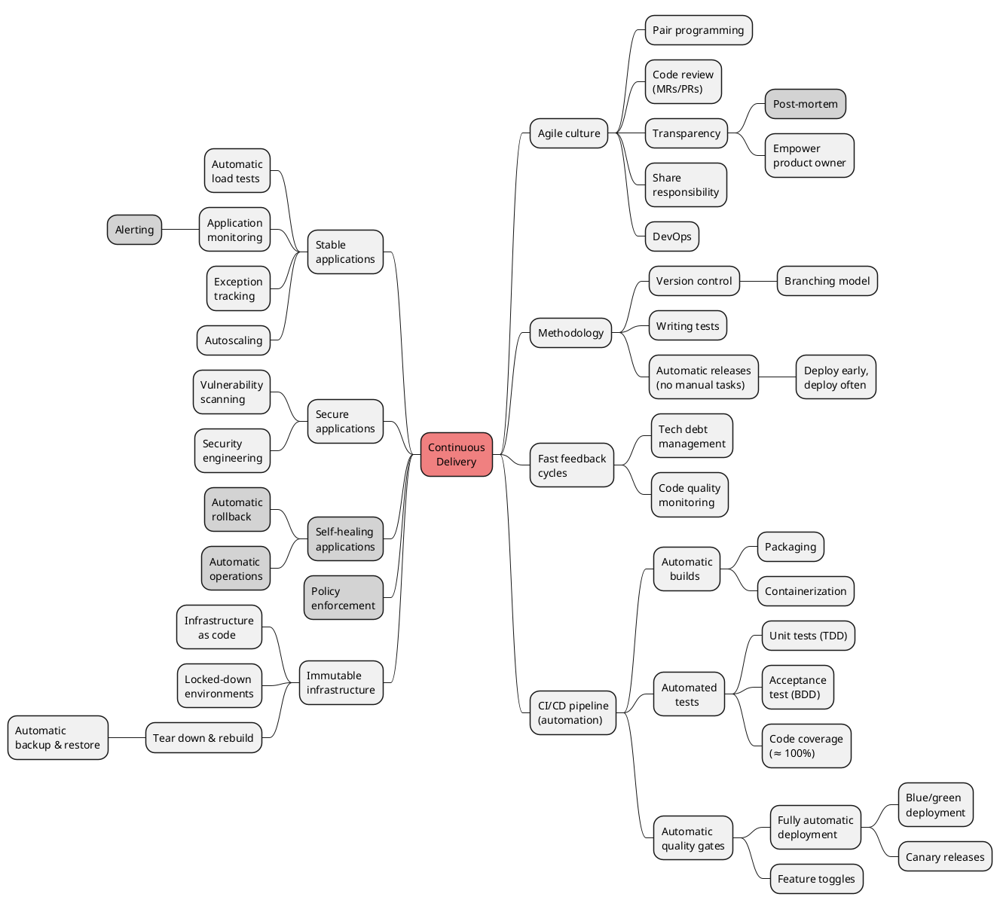

Continuous Delivery – CI/CD
===========================

Related Resources
-----------------

- [Google Engineering Practices Documentation](https://google.github.io/eng-practices/) (code reviews)
- [Google Site Reliability Engineering](https://sre.google/sre-book/table-of-contents/) (SRE)
- [What is CI/CD?](https://about.gitlab.com/topics/ci-cd/) (GitLab)
- [What is DevOps?](https://about.gitlab.com/topics/devops/) (GitLab)
- [What is DevOps?](https://www.atlassian.com/devops) (Atlassian)
- [Continuous Delivery](https://painless.software/continuous-delivery) (Painless Software)
