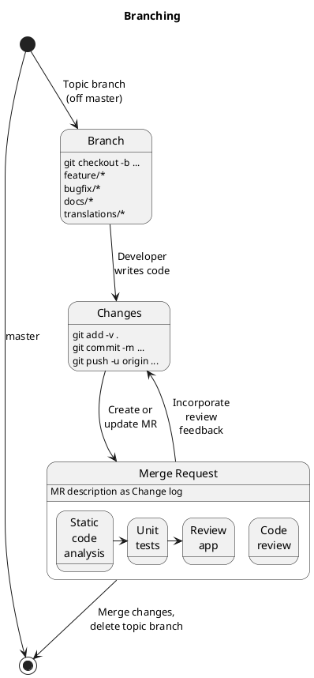

Branching + Development
=======================

- Keep it as simple as possible
- A single main branch + topic branches (short-lived!)
- Write tests for every single feature + every bugfix
- Use feature toggles to control feature releases (not branches!)

> Use branching to ensure only working code is merged into your main branch. Don't use it to control feature releases.

Related Topics
--------------

- [Build images](devops-environments.md) ➜ Deployment
