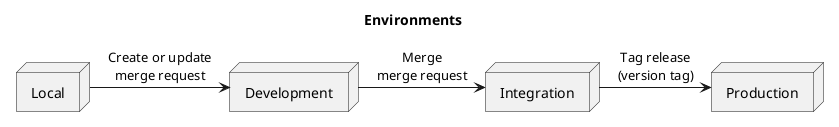

```plantuml
@startuml
title Environments

Local -> Development : Create or update\nmerge request
Development -> Integration : Merge\nmerge request
Integration -> Production : Tag release\n(version tag)

node Local {
}

node Development {
}

node Integration {
}

node Production {
}

@enduml
```
