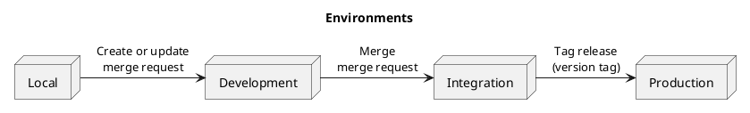

Environments + Deployment
-------------------------

- Local ➜ Development ➜ Integration ➜ Production
- Static code analysis ➜ unit tests ➜ other tests (fastest first)
- Vulnerability scanning:
  1. Base image
  1. App dependencies
  1. App code
- Tag build artifacts with your source code commit SHA (audit trail)
- Triggers:
  1. **Open MR/PR:** Build review app ➜ deploy to Development
  1. **Merge MR/PR:** Build app ➜ deploy to Integration
  1. **Push Git tag:** Deploy app to Production (don't build it again!)

> Deploy every single, working feature directly. Give your PO control over the feature flags – not your release ceremony.

