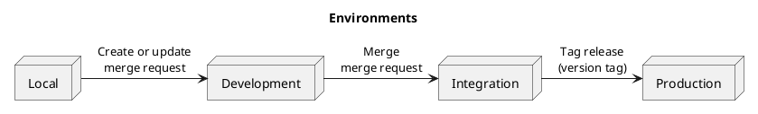
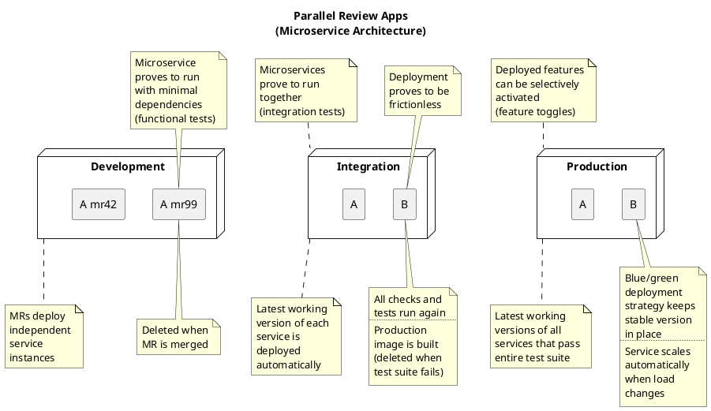

Environments + Deployment
=========================

- Local ➜ Development ➜ Integration ➜ Production
- Static code analysis ➜ unit tests ➜ other tests (fastest first)
- Vulnerability scanning:
  1. Base image
  1. App dependencies
  1. App code
- Tag build artifacts with your source code commit SHA (audit trail)
- Triggers:
  1. **Open MR/PR:** Build review app ➜ deploy to Development
  1. **Merge MR/PR:** Build app ➜ deploy to Integration
  1. **Push Git tag:** Deploy app to Production (don't build it again!)

> Deploy every single, working feature directly. Give your PO control over the feature flags – not your release ceremony.

Environments
------------

Each environment increases the confidence in a fully operational resulting
application that a work increment contributes to.

Deployment
----------

Based on blue/green deployment and stable container images we ensure that
both Integration and Production are in a fully operational state at all times.

Integration should be deleted and recreated afresh regularly (e.g. each week).

In an advanced approach, we could swap Production and Integration on each deployment.

Related Topics
--------------

- [Release notes](devops-branching.md) ➜ MR description
